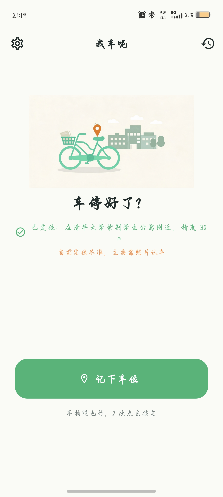
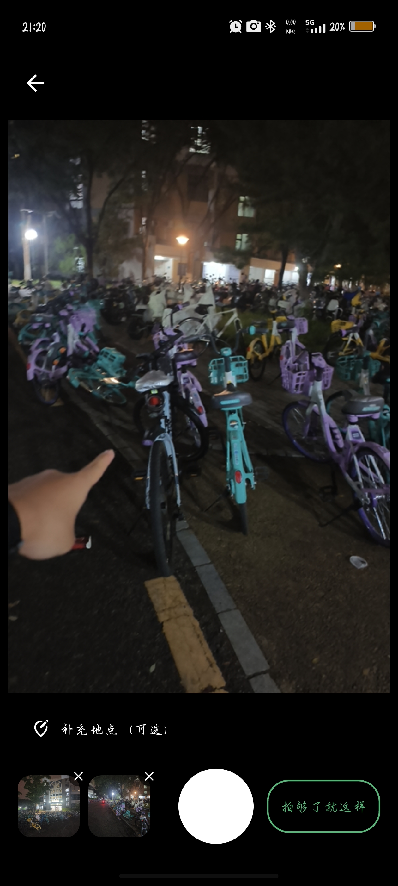
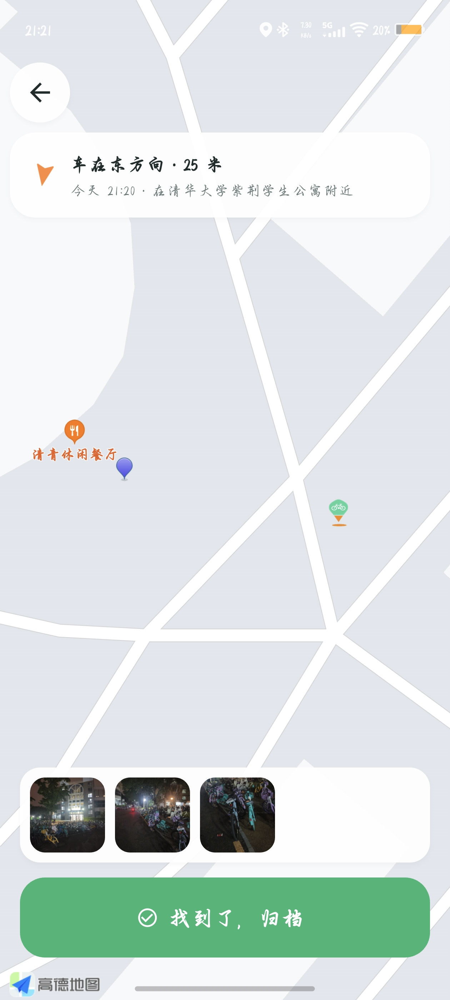
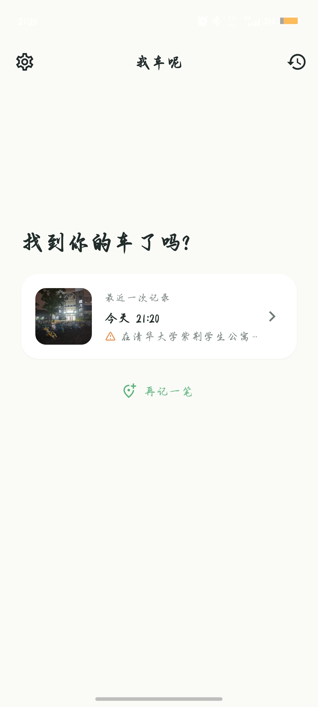
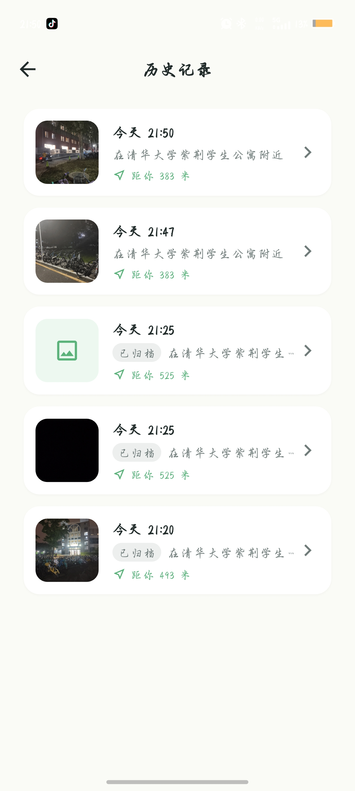
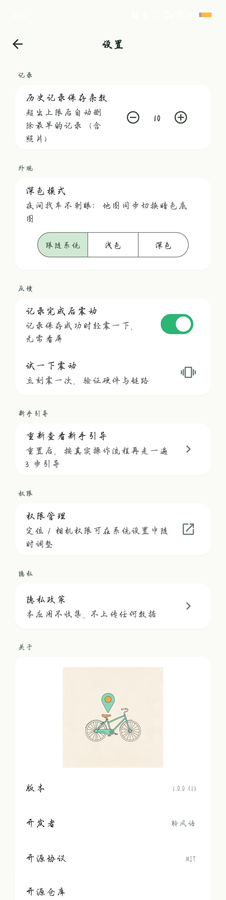
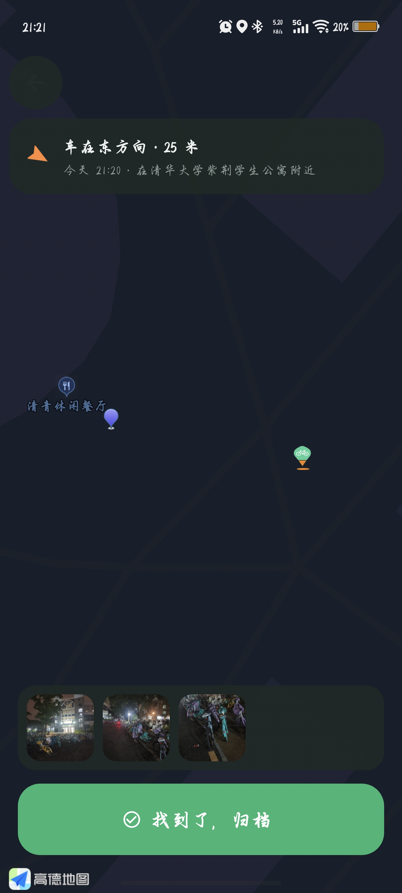
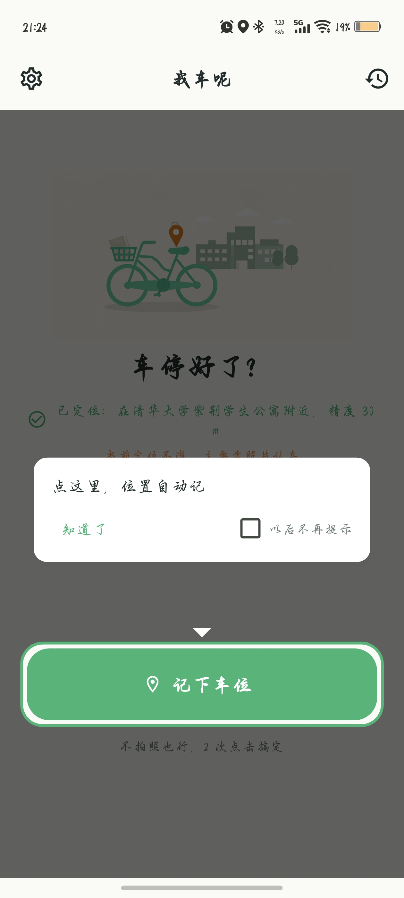
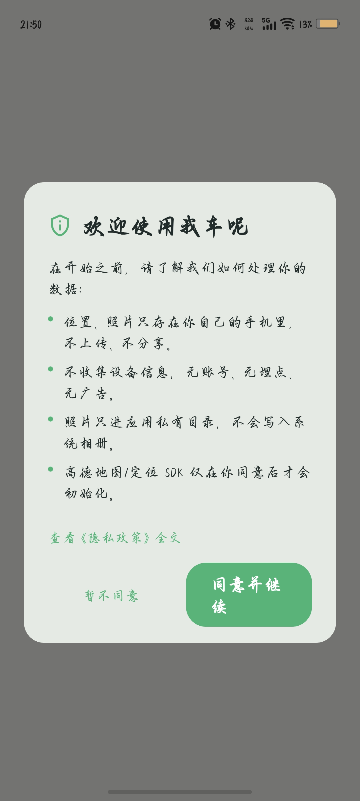

# 我车呢（wo-che-ne）

> 秒记自行车位，秒找车。—— 在偌大的校园里，不再为「我车呢」发愁。


「我车呢」是一个**纯本地**的找车小工具：停车时花几秒钟记下一笔「位置 + 照片」，
找车时打开它，地图会告诉你车在哪个方向、多远，再翻出当时拍的照片对着认。

- **秒记车位**：拍 0–3 张照片即可存好一笔记录；设计目标为**≤ 3 次点击、≤ 10 秒**完成一次记录（PRD 北极星指标，见 [`docs/PRD.md`](docs/PRD.md)）。定位权限在你点「记下车位」时才申请（合规红线），已授权时进入停车态会自动定位。
- **照片只进应用私有目录**：不写系统相册，也不申请相册读取权限。
- **纯本地，无账号、无后端、无云同步**：没有 SQLite，没有服务器，数据全在你手机里。
- **找车页给方向和距离**：顶部胶囊显示「车在东方向 · 25 米」并带方向箭头。
- **深色模式**：可选跟随系统 / 浅色 / 深色。

仓库地址：<https://github.com/946983543293/wo-che-ne>
隐私政策：[PRIVACY.md](PRIVACY.md) ｜ 开源协议：[MIT](LICENSE)

---

## 项目定位与当前状态（请先读这一段）

这是一个**个人课程 / 自用性质的小项目**，不是商业产品。为了不让人误会，把现状如实写在这里：

| 平台 | 状态 |
|---|---|
| **Android** | ✅ 唯一实际开发并在真机跑通的平台。本仓库的构建脚本、权限、图标都只针对 Android 配置 |
| iOS | ⚠️ `ios/` 是 `flutter create` 生成的**脚手架，未做任何适配**：未配置高德 iOS Key，未添加定位用途描述（`Info.plist` 仍是模板内容，显示名还是 `Wo Che Ne`）。**不能直接构建运行** |
| Web | ⚠️ `web/` 同样是 `flutter create` 生成的**脚手架，未做适配，未使用** |

- 地图与定位依赖**高德开放平台**，你需要[自行申请 Key](#3-配置高德-key必需)才能跑起来；高德 SDK 受其自身商业条款约束。
- 版本：`pubspec.yaml` 中为 `1.0.0+1`；包名（`applicationId`）`com.wochene.app`，Android `namespace` 为 `com.wochene.wo_che_ne`。

---

## 快速开始

### 1. 环境要求

| 项 | 要求 | 出处 |
|---|---|---|
| Flutter / Dart | `environment.sdk: ^3.13.4`（即 Dart 3.13.4 起） | `pubspec.yaml` |
| 开发与验证环境 | Flutter 3.47.5 / Dart 3.13.4（stable） | 本机 `flutter --version` 实测 |
| JDK | **17** | `android/app/build.gradle.kts`：`sourceCompatibility` / `targetCompatibility` = `VERSION_17`，Kotlin `jvmTarget` = `JVM_17` |
| Android Gradle Plugin | 9.1.0 | `android/settings.gradle.kts` |
| Kotlin | 2.4.0 | `android/settings.gradle.kts` |
| Android SDK 版本 | 本仓库**不硬编码**，三个值都取自 Flutter 工具链：`compileSdk = flutter.compileSdkVersion`、`minSdk = flutter.minSdkVersion`、`targetSdk = flutter.targetSdkVersion` | `android/app/build.gradle.kts` |
| 实测产物取值 | compileSdk 36 / targetSdk 36 / minSdk 24 | `docs/QA-T05-report.md` 用 `aapt2 dump badging` 直查 release APK 得到 |

> 补充：`android/build.gradle.kts` 会把**所有** Android 子工程的 `compileSdk` 统一抬到 36
> （部分旧插件硬编码 33，而新版 androidx 依赖要求 ≥ 34）。

### 2. 拉取代码并安装依赖

```bash
git clone https://github.com/946983543293/wo-che-ne
cd wo-che-ne
flutter pub get
```

> 仓库**自带 Gradle Wrapper**（`android/gradlew`、`gradlew.bat`、`gradle-wrapper.jar` 均随仓库分发），
> **无需本地预先安装 Gradle**。
> 中国大陆网络可按需配置镜像：`PUB_HOSTED_URL=https://pub.flutter-io.cn`、
> `FLUTTER_STORAGE_BASE_URL=https://storage.flutter-io.cn`。
> `android/build.gradle.kts` 与 `android/settings.gradle.kts` 已把 Maven 仓库改为
> 「阿里云镜像优先 + 官方源兜底」，高德 SDK（`com.amap.api:*`）也从阿里云 public 镜像拉取。

### 3. 配置高德 Key（必需）

**这是跑不起来的最大坑**，请认真读完。

地图与定位用的是**高德 Android SDK**，而高德是按 **「包名 + 签名 SHA1」** 鉴权的。
本项目的 **debug 包和 release 包签名不同**（debug 用你本机的 debug keystore，release 用你自己的
发布 keystore），两者的 SHA1 不一样，所以**必须各申请一个 Key**：

| 字段 | 给谁用 | 绑定的签名 SHA1 |
|---|---|---|
| `AMAP_KEY` | debug 包 | 本机 debug keystore 的 SHA1 |
| `AMAP_KEY_RELEASE` | release 包 | 你自己的 release keystore 的 SHA1 |

**申请步骤**

1. 注册[高德开放平台](https://lbs.amap.com/)个人开发者并完成实名认证。
2. 控制台 → 应用管理 → 创建新应用 → 添加 Key，服务平台选 **Android**，并填写：
   - 包名：**`com.wochene.app`**（必须与 `applicationId` 完全一致）
   - 签名 SHA1：**用你自己的签名指纹**。本仓库**不包含任何 keystore**（`*.jks`、`*.keystore` 已被 `.gitignore` 排除），
     所以 debug 与 release 各加一个 Key（同一个应用下可以添加多个 Key）。

   查看 SHA1：

   ```bash
   # debug（本机默认 debug keystore）
   keytool -list -v -keystore ~/.android/debug.keystore -alias androiddebugkey -storepass android -keypass android

   # release（用你自己生成的 keystore）
   keytool -list -v -keystore <你的.jks> -alias <别名>
   ```

3. 复制 `android/local.properties.example` 为 `android/local.properties`，填入两个 Key：

   ```properties
   AMAP_KEY=你的高德Key（debug 用）
   AMAP_KEY_RELEASE=你的高德Key（release 用）
   ```

   `local.properties` 已被 `.gitignore` 排除，**Key 绝不提交进 Git**。
   （判断逻辑见 `android/app/build.gradle.kts`：以 `请在此填入` 开头的值视为「未配置」。）

**三种配置情况的后果**（均由 `android/app/build.gradle.kts` 决定）：

| 配置情况 | 后果 |
|---|---|
| 两个都配了 | ✅ 正常。debug 包嵌 `AMAP_KEY`，release 包嵌 `AMAP_KEY_RELEASE` |
| 只配了 `AMAP_KEY` | ⚠️ Release 会回退嵌入这个 Key 并打印中文警告——但它绑定的是 debug 签名，**真机地图无法鉴权** |
| 两个都没配 | Debug 放行（嵌入占位值 `AMAP_KEY_NOT_CONFIGURED`，地图/定位在真机不可用，但编译/分析/单测不受影响）；**Release 构建直接中止**并抛出中文指引 |

### 4. 构建

```bash
flutter build apk --debug      # 调试包（未配高德 Key 也能构建）
flutter build apk --release    # 发布包（必须已配置高德 Key）
```

产物：`build/app/outputs/flutter-apk/app-debug.apk`、`build/app/outputs/flutter-apk/app-release.apk`

**关于 release 签名**（仅在你打算分发 release 包时需要）：

- 签名口令从 `android/keystore.properties` 读取（四项：`storeFile` / `storePassword` / `keyAlias` / `keyPassword`）。
  该文件与 `*.jks` 均已被 `.gitignore` 排除，**请自行生成并离线备份**。
- 该文件缺失时不会构建失败，而是**回退 debug 签名**并在 `assembleRelease` 时给出中文警告——
  这样没有 keystore 的协作者仍能 `flutter run --release`，但该包**不能用于正式分发**（无法覆盖更新）。

### 5. 装到真机

```bash
adb install -r build/app/outputs/flutter-apk/app-release.apk
```

> ⚠️ **从 debug 包换成 release 包前，必须先卸载旧的 debug 包**：
> ```bash
> adb uninstall com.wochene.app
> ```
> 两者签名不同，直接覆盖安装会报 `INSTALL_FAILED_UPDATE_INCOMPATIBLE`。

首次启动会弹出**隐私政策同意框**；**同意之后**高德 SDK 才会初始化（合规红线：同意前不做任何初始化）。
点「暂不同意」会进入**降级模式**（受限首页，可随时再次唤起同意框）。

---

## 技术栈

具体版本以 [`pubspec.yaml`](pubspec.yaml) 为准，这里只列用途：

| 类别 | 选型 |
|---|---|
| 框架 | Flutter / Dart |
| 状态管理 | `flutter_riverpod` |
| 本地存储 | `shared_preferences` + `path_provider` |
| 拍照 | `camera` |
| 地图 / 定位 | 高德 `amap_flutter_map` / `amap_flutter_location` / `amap_flutter_base` |
| 运行时权限 | `permission_handler` |
| 指南针朝向 | `flutter_compass_v2` |
| 其他 | `vibration`（记录完成震动反馈）、`intl`（时间格式化）、`uuid`（记录 ID）、`package_info_plus`（版本号） |
| 静态检查 | `flutter_lints`（见 [`analysis_options.yaml`](analysis_options.yaml)，额外开启 `public_member_api_docs`） |

### 数据存在哪

```
应用私有目录/
├── records.json     # 全部停车记录（单个 JSON 文件）
└── photos/          # 停车照片
SharedPreferences    # 设置项，键名形如 settings.themeMode / settings.maxRecords
```

- **没有 SQLite，没有后端，没有账号系统**。
- 历史记录上限默认 **10** 条，可在 3–20 之间调整，超限自动淘汰最早记录；每条记录最多 **3** 张照片。
- 卸载应用即删除全部数据（含照片）。

---

## 隐私

完整版见 [PRIVACY.md](PRIVACY.md)，摘要：

- 停车位置、照片、设置**全部只存在本机**。
- **不申请相册读取权限**（刻意不声明 `READ_MEDIA_IMAGES`），照片只写应用私有目录。
- **不申请录音权限**，并用 `tools:node="remove"` 显式移除了第三方插件可能带入的
  `RECORD_AUDIO`、`READ_EXTERNAL_STORAGE`、`WRITE_EXTERNAL_STORAGE` 三条权限。
- 位置数据不上传；除高德 SDK 为提供地图/定位服务所必需的网络请求外，应用自身没有任何网络请求。
- 无埋点、无统计、无广告 SDK。

release APK 实测只声明 **8 条系统权限**（来源：`docs/QA-T05-report.md` 的 `aapt2 dump permissions`）：
`ACCESS_FINE_LOCATION`、`ACCESS_COARSE_LOCATION`、`CAMERA`、`INTERNET`、`ACCESS_NETWORK_STATE`、
`ACCESS_WIFI_STATE`、`CHANGE_WIFI_STATE`、`VIBRATE`。

---

## 关于 `third_party/`（重要，涉及许可证）

高德官方 Flutter 插件（`amap_flutter_base` / `amap_flutter_map` / `amap_flutter_location`）的
**最新版本仍是 3.0.0（2022 年发布，已停止维护）**，在新工具链下无法直接构建：

- `sdk: ">=2.12.0 <3.0.0"` 与 Dart 3 不兼容；
- 构建脚本用了 Gradle 9 已移除的 `jcenter()` 与遗留 DSL（`compileSdkVersion` / `lintOptions` 等）；
- 插件内自带 `buildscript { classpath 'AGP 3.5.x' }`，与宿主 AGP 9 冲突。

因此本仓库把这三个包 **vendoring 到 `third_party/`**，通过 `pubspec.yaml` 的
`dependency_overrides` 指向本地路径，并做了**最小现代化改造**（只改构建脚本与 pubspec，
**不改任何 Dart / Java 源码逻辑**）。

> ⚠️ **许可证不同**：`third_party/amap_flutter_*` 各包自带 LICENSE，是
> **BSD 3-Clause（Copyright 2020 lbs.amap.com）**，与主项目的 MIT **不同**。
> 二次分发时请一并保留这些 LICENSE。改造清单与维护指引详见 [`third_party/README.md`](third_party/README.md)。

另外，release 构建的 R8 会改类名并打断高德 SDK 的反射调用，
`android/app/proguard-rules.pro` 中保留了 `com.amap.api.**` / `com.autonavi.**` / `com.amap.flutter.**`。

---

## 测试

在 Flutter 3.47.5 / Dart 3.13.4（stable）环境下实测：

```bash
flutter analyze    # → No issues found! (exit 0)
flutter test       # → All tests passed! 180 个用例全通过 (exit 0)
```

> **Windows 用户注意**：本仓库提供了 [`tool/flutter.ps1`](tool/flutter.ps1) 包装脚本。
> 某些宿主环境会向子进程注入本地 HTTP 代理，导致 `flutter test` 连不上 `flutter_tester`
> 的 VM Service（报错 `WebSocketException: Invalid WebSocket upgrade request`）。
> 该脚本会为每次调用设置 `NO_PROXY`，遇到上述报错时改用：
> ```powershell
> .\tool\flutter.ps1 test
> .\tool\flutter.ps1 analyze
> ```

---

## 文档索引

| 文档 | 内容 |
|---|---|
| [docs/PRD.md](docs/PRD.md) | 产品需求文档（v1.2）：产品目标与核心指标、功能范围、权限与隐私红线、设计质量要求 |
| [docs/ARCHITECTURE.md](docs/ARCHITECTURE.md) | 系统架构设计（v1.3，对应 PRD v1.2）：分层结构、插件选型、关键难点对策与任务分解 |
| [PRIVACY.md](PRIVACY.md) | 隐私政策（应用内与仓库同步维护） |
| [CONTRIBUTING.md](CONTRIBUTING.md) | 如何提 Issue / PR、代码风格与测试要求 |
| [LICENSE](LICENSE) | 主项目许可证（MIT） |
| [third_party/README.md](third_party/README.md) | vendored 高德插件的改造清单与维护指引 |
| [assets/prompts.md](assets/prompts.md) | 全部设计素材的 AI 生图提示词记录（素材自产、可复现） |
| [docs/QA-T03-report.md](docs/QA-T03-report.md)、[docs/QA-T04-report.md](docs/QA-T04-report.md)、[docs/QA-T05-report.md](docs/QA-T05-report.md) | 各阶段的 QA 独立验证报告 |

---

## 截图

以下均为**真机原图**（未压缩，单张最大约 1.2 MB）。

### 核心流程

<p align="center">
  <br/>
  <sub>首页 · 停车态：进入即自动定位并显示精度；定位不佳时提示「主要靠照片认车」，不拍照也能记</sub>
</p>

<p align="center">
  <br/>
  <sub>拍照页：沉浸式取景，缩略图可单张删除，也可先「补充地点」再「拍够了就这样」</sub>
</p>

<p align="center">
  <br/>
  <sub>地图找车页：顶部胶囊给出方向与直线距离，底部是当时拍的照片，「找到了，归档」收尾</sub>
</p>

<p align="center">
  <br/>
  <sub>首页 · 找车态：记录完成后首页随之切换，最近一次记录一键进入地图找车</sub>
</p>

### 更多界面

<p align="center">
  <br/>
  <sub>历史记录页：按时间倒序，含「已归档」标记与「距你 xxx 米」</sub>
</p>

<p align="center">
  <br/>
  <sub>设置页：记录上限、深色模式、震动反馈、引导重放、权限与隐私入口、关于（版本 / 开发者 / 协议）</sub>
</p>

<p align="center">
  <br/>
  <sub>深色模式 · 停车态</sub>
</p>

<p align="center">
  <br/>
  <sub>深色模式 · 地图找车页（地图同样切换为深色样式）</sub>
</p>

<p align="center">
  <br/>
  <sub>叠加式新手引导：在真实界面上逐步提示，可勾选「以后不再提示」</sub>
</p>

<p align="center">
  <br/>
  <sub>首次启动的隐私政策同意弹窗：同意后高德 SDK 才会初始化（合规红线）</sub>
</p>

想补充其他机型或主题的截图？欢迎提 PR，要求见 [CONTRIBUTING.md](CONTRIBUTING.md)。

---

## 许可与署名

- **主项目**：MIT，见 [LICENSE](LICENSE)（Copyright (c) 2026 我车呢贡献者）。
- **`third_party/`**：BSD 3-Clause（Copyright 2020 lbs.amap.com），各包 LICENSE 已随源码保留。
- **高德地图 SDK**：其使用受《高德地图开放平台服务条款》约束，需自行申请 Key。
- **开发者署名**：**聆风语**（<https://github.com/946983543293>）——应用内「设置 → 关于」展示。
- 全部设计素材由 AI 生图自产，提示词记录于 [assets/prompts.md](assets/prompts.md)。
