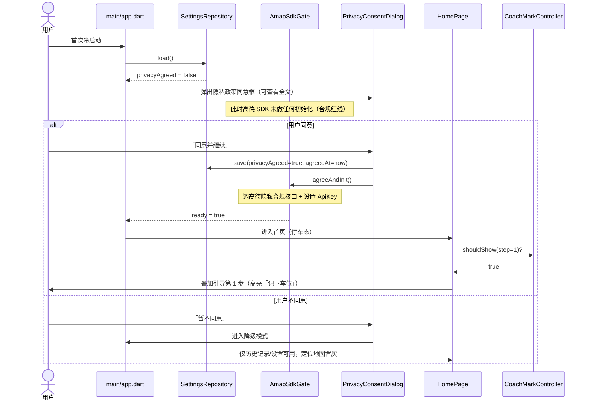
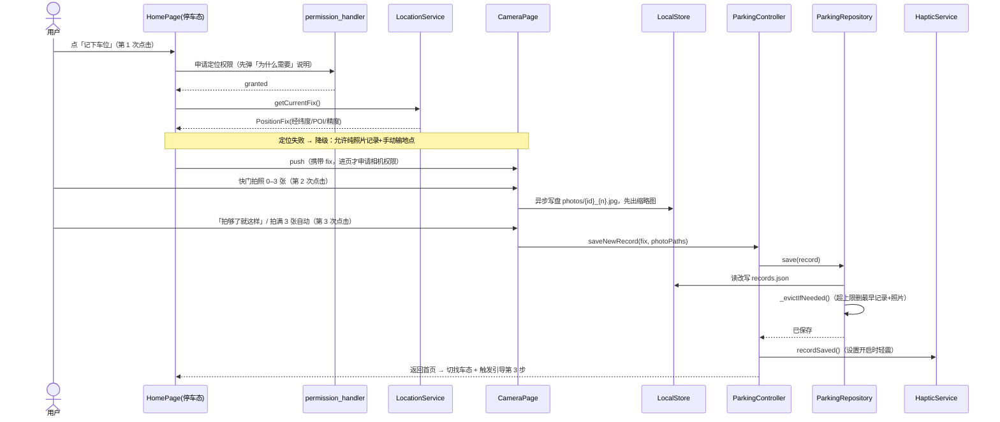
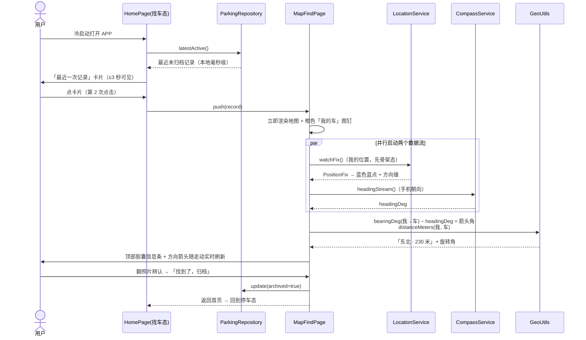
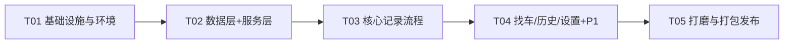

# 「我车呢」系统架构设计 + 任务分解

| 项目信息 | 内容 |
|---|---|
| 文档版本 | v1.3（对应 PRD v1.2，P0 已冻结） |
| 作者 | 架构师 高见远（Gao） |
| 技术栈 | Flutter（Dart）/ Android 首发，预留 iOS / 纯本地存储 |
| 目标读者 | 工程实现团队、主理人 |

> **v1.3 变更**：T03 修复轮完成（QA Round 1 抓到引导遮罩坐标错位 P1 已修，用例转绿）。本次：① §7 新增**第 10 条「照片数量上限的职责边界」**（采集侧把关 / 控制器不静默截断，由 `test/t03_parking_controller_test.dart` 固化为契约）；② §9 新增 **9-9「权限最小化落地」**、**9-10「已知告警与待跟进」**；③ §5 T03 状态更新为「已过 QA Round 1，待复验」。
>
> **v1.2 变更**：T02 已完工并验收（36 单测全绿、analyze 无 issue）。明确 **T03 范围含「启动接门」**；§9 新增 9-8「本机代理坑」；§2 文件树补标 T02 产出与 `tool/flutter.ps1`；§6 加注 NO_PROXY 约定。
>
> **v1.1 变更**：T01 已完工并验收。据施工实测新增 §9 施工变更记录，并同步修订 §1.5 插件表、§2 文件树、§6 依赖表、§5 T02 产出清单。
>
> 设计原则：**极简可落地**——项目规模小（≤6 页面、≤20 条数据），一切选型以「简单、可测、少依赖」为准，拒绝过度设计。

---

## 1. 实现方案与框架/插件选型

### 1.1 核心技术难点与对策

| 难点 | 对策 |
|---|---|
| **合规红线：隐私政策同意前不得初始化高德 SDK** | `AmapSdkGate` 服务统一把守：所有高德 API 调用前必须 `gate.ensureReady()`；同意状态存 shared_preferences；首启同意框是应用级前置门（见时序图①） |
| **首页双状态（停车态/找车态）** | 不建两个页面：`HomePage` 依据 `latestActiveRecordProvider` 是否为 null 切换两棵子 Widget 树 |
| **拍照不卡顿（中低端机连拍 3 张）** | `camera` 插件 + `ResolutionPreset.medium`；快门后立即出缩略图（用插件返回的临时文件），字节异步转存私有目录；3 张上限即性能护栏 |
| **冷启动找车 ≤ 3 秒** | 车位置来自本地 JSON（毫秒级），地图页先渲染车图钉；「我的位置」蓝点骨架态，定位流到达后刷新 |
| **方向箭头（P1-1）** | 指南针朝向角 + 两坐标方位角差值 = 箭头旋转角，纯本地计算（`GeoUtils`），无需网络 |

### 1.2 架构分层

```
┌─────────────────────────────────────────────┐
│ UI 层        pages/ + widgets/（只读状态、发事件）│
├─────────────────────────────────────────────┤
│ 状态层       state/（Riverpod Notifier，编排用例）│
├─────────────────────────────────────────────┤
│ 服务层       services/（定位/指南针/震动/快捷方式/SDK 门）│
├─────────────────────────────────────────────┤
│ 数据层       data/（models + repository + 本地读写）│
├─────────────────────────────────────────────┤
│ 平台层       高德 SDK / camera / 系统权限（插件隔离）  │
└─────────────────────────────────────────────┘
```

依赖方向只允许向下：UI → 状态 → 服务/数据 → 平台。服务层不感知 UI，数据层不感知插件（Repository 接口隔离），保证可单测。

### 1.3 状态管理选型：**Riverpod**

| 候选 | 结论 | 理由 |
|---|---|---|
| **flutter_riverpod** | ✅ **选用** | 编译期安全、不依赖 BuildContext（服务层/数据层可直接被注入，单元测试极易）；`Notifier` + `Provider` 两个概念即可覆盖本项目全部场景；是 Provider 的官方继任者 |
| Provider | 备选 | 更简单但依赖 Widget 树取值，跨层测试不便 |
| Bloc | ❌ 弃用 | 事件/状态双类样板过重，6 个页面的小项目属于杀鸡用牛刀 |

用法约定：设置/记录列表等可变状态用 `NotifierProvider`；定位流、指南针流用 `StreamProvider`；一次性读取（如包信息）用 `Provider`。

### 1.4 本地存储选型：**shared_preferences + JSON 文件**（不用 sqflite/drift）

| 数据 | 载体 | 理由 |
|---|---|---|
| 设置项、隐私同意、引导状态 | `shared_preferences` | 键值对天然匹配；无需建表 |
| 停车记录（≤20 条） | **单个 JSON 文件**（应用私有目录 `records.json`） | 数据量极小且无关系查询，数据库是纯负担；全量读写在 20 条规模下微秒级；JSON 人类可读，对开源项目友好；零原生依赖，构建快、测试易 |
| 照片文件 | 应用私有目录 `photos/`（`path_provider.getApplicationDocumentsDirectory()`） | 不进系统相册；卸载即清除，满足 P0-4 |

> 若未来记录量上百或需复杂检索，可在 `ParkingRepository` 接口内换成 sqflite 实现，UI/状态层零改动——接口隔离已为此留好退路。

### 1.5 插件清单（版本策略：锁 major，`^x.0.0`，minor 由 `flutter pub get` 解析）

| 插件 | 用途 | 对应需求 |
|---|---|---|
| `amap_flutter_map` | 高德地图（找车页双标记、浅色/暗色底图） | P0-6 |
| `amap_flutter_location` | 高德融合定位（GPS+Wi-Fi+基站） | P0-2 |
| `camera` | 拍照（ResolutionPreset.medium） | P0-3 |
| `permission_handler` | 运行时权限申请与状态查询 | P0（§7 权限模型） |
| `flutter_compass_v2` | 指南针朝向（方向箭头） | P1-1 |
| `quick_actions` | Android 桌面快捷方式「一键记车位」 | P1-2 |
| `vibration` | 记录完成震动反馈 | Q2 已决（默认开） |
| `shared_preferences` / `path_provider` | 设置存储 / 私有目录 | P0-4、P0-5 |
| `intl` / `uuid` | 时间格式化（「今天 12:24」）/ 记录 ID | 通用 |
| `package_info_plus` | 关于页版本号 | 4.7 设置页 |

> ⚠️ **高德三插件（map/location/base）已本地 vendoring**：官方版停留 3.0.0（2022），与新工具链不兼容，已复制到 `third_party/` 并经 `dependency_overrides` 指向本地路径使用；高德运行库（`com.amap.api:3dmap`、`com.amap.api:location`）改由 **app 侧** `android/app/build.gradle.kts` 以 `implementation` 引入（插件内仅 `compileOnly`）。详见 §9-1、§9-2。**代码里仍按 pub 包名 import，T02/T03 无感。**

完整版本约束见 §6 依赖包列表。

---

## 2. 文件列表及相对路径

工程根目录：`wo_che_ne/`（实际绝对路径 `F:\WorkBuddy_data\wo-che-ne\wo_che_ne\`；`flutter create --org com.wochene --project-name wo_che_ne` 生成后按下表组织）

> 标 **✅T01** / **✅T02** / **✅T03** 者为对应任务已完成产出；未标注者为待建（行尾注明所属任务）。

```
wo_che_ne/
├── pubspec.yaml                    # ✅T01 依赖与资源声明（含 dependency_overrides → third_party）
├── analysis_options.yaml           # ✅T01 flutter_lints 静态检查规则
├── .gitignore                      # ✅T01 含 local.properties / *.jks / *.key / .env（开源红线）
├── README.md                       # ✅T01 项目介绍 + 高德 Key 自助申请指引 + 构建说明
├── LICENSE                         # ✅T01 MIT
├── PRIVACY.md                      # ✅T01 隐私政策（仓库与 APP 内同步维护）
├── third_party/                    # ✅T01 vendored 高德插件（详见 §9-1 与 third_party/README.md）
│   ├── README.md                   #   改造点清单 + 升级回退指引
│   ├── amap_flutter_base/          #   官方 3.0.0 本地副本（仅改构建脚本/pubspec）
│   ├── amap_flutter_map/           #   同上（Dart 侧 hashValues→Object.hash 适配）
│   └── amap_flutter_location/      #   同上
├── android/
│   ├── build.gradle.kts            # ✅T01 仓库镜像 + subprojects 钩子统一 compileSdk=36
│   ├── gradle.properties           # ✅T01 UTF-8 强制解码 + 中文路径放行（§9-3）
│   ├── local.properties.example    # ✅T01 高德 Key 占位模板（提交入库）
│   └── app/
│       ├── build.gradle.kts        # ✅T01 applicationId、AMAP_KEY 占位、高德运行库、签名配置
│       └── src/main/
│           ├── AndroidManifest.xml # 权限声明 + ${AMAP_KEY} 占位 + quick_actions 入口
│           └── res/xml/shortcuts.xml  # 桌面快捷方式定义（P1-2，T04 建）
├── assets/
│   ├── images/                     # Seedream 生成插图（空状态/关于页，T05 填充）
│   └── prompts.md                  # ✅T01 AI 生图提示词记录（开源红线第 4 条）
├── lib/
│   ├── main.dart                   # ✅T03 入口：读同意状态 → ProviderScope → initIfAgreed() 启动接门
│   ├── app.dart                    # ✅T03 MaterialApp：主题/路由/深色模式/隐私同意前置门
│   ├── core/
│   │   ├── constants.dart          # ✅T01 存储键名、上限默认值（maxPhotosPerRecord=3 等）、路由名
│   │   ├── theme/
│   │   │   ├── app_colors.dart     # ✅T01 Design Tokens 颜色常量（#2BB673 等）
│   │   │   └── app_theme.dart      # ✅T01 Tokens → 浅色/深色 ThemeData
│   │   └── utils/
│   │       ├── geo_utils.dart      # ✅T02 方位角/直线距离/方向文案（「东北·230米」）
│   │       └── time_utils.dart     # ✅T02 「今天 12:24」人性化时间格式
│   ├── data/
│   │   ├── models/
│   │   │   ├── parking_record.dart # ✅T02 停车记录模型 + JSON 序列化
│   │   │   └── app_settings.dart   # ✅T02 设置模型 + JSON 序列化
│   │   ├── storage/
│   │   │   └── local_store.dart    # ✅T02 records.json 与 photos/ 目录的原子读写
│   │   └── repositories/
│   │       ├── parking_repository.dart      # ✅T02 记录仓储接口 + JSON 实现（含淘汰）
│   │       └── settings_repository.dart     # ✅T02 设置仓储接口 + prefs 实现
│   ├── services/
│   │   ├── amap_sdk_gate.dart      # ✅T02 合规门：同意前禁初始化，agreeAndInit()/initIfAgreed()/ensureReady()
│   │   ├── location_service.dart   # ✅T02 高德定位封装（单次 fix + 流式 watch）
│   │   ├── haptic_service.dart     # ✅T02 震动反馈（读设置开关）
│   │   ├── compass_service.dart    # 指南针朝向流（P1-1）— T04 建
│   │   └── shortcut_service.dart   # 桌面快捷方式注册与跳转参数（P1-2）— T04 建
│   ├── state/
│   │   ├── providers.dart          # ✅T03 全局 Provider 装配（仓库/服务注入）
│   │   ├── parking_controller.dart # ✅T03 记录 CRUD、归档、淘汰编排（不静默截断照片，§7-10）
│   │   ├── settings_controller.dart# ✅T03 设置读写、主题模式映射
│   │   └── coach_mark_controller.dart # ✅T03 引导 3 步状态机（触发/完成/永久关闭）
│   ├── pages/
│   │   ├── home/home_page.dart             # ✅T03 首页双状态（停车态/找车态）
│   │   ├── camera/camera_page.dart         # ✅T03 拍照页（取景/缩略图/「拍够了就这样」/3 张上限把关）
│   │   ├── map_find/map_find_page.dart     # 地图找车页（双标记/方向箭头/照片条）— T04 建
│   │   ├── history/history_page.dart       # 历史记录列表（倒序）— T04 建
│   │   ├── history/record_detail_page.dart # 记录详情（只读 + 删除）— T04 建
│   │   └── settings/settings_page.dart     # 设置页（含隐私政策/关于）— T04 建
│   └── widgets/
│       ├── privacy_consent_dialog.dart # ✅T03 首启隐私政策同意框（合规核心组件）
│       ├── coach_mark_overlay.dart     # ✅T03 叠加引导层（挖空高亮 + 气泡 + 复选框）
│       ├── primary_button.dart         # ✅T03 主按钮（64dp、主色填充、按压动效）
│       ├── photo_strip.dart            # 照片横排条（缩略图/全屏浏览入口）— T04 建
│       └── empty_state.dart            # ✅T03 空状态（Seedream 插图 + 一句话文案）
├── test/
│   ├── geo_utils_test.dart           # ✅T02 方位角/距离/方向文案单测
│   ├── time_utils_test.dart          # ✅T02 时间格式化单测
│   ├── parking_repository_test.dart  # ✅T02 淘汰策略/增删改/JSON 序列化单测
│   ├── amap_sdk_gate_test.dart       # ✅T02 合规门单测（未同意时 ensureReady() 抛异常等）
│   ├── widget_test.dart              # ✅T01 Flutter 模板冒烟测试（保 T01 冒烟基线）
│   ├── coach_mark_controller_test.dart # ✅T03 引导状态机单测
│   ├── t03_parking_controller_test.dart # ✅T03 照片上限职责边界契约（4 张原样入库，§7-10）
│   ├── t03_camera_flow_test.dart        # ✅T03 拍照→保存流程单测
│   ├── t03_privacy_gate_test.dart       # ✅T03 隐私门/启动接门单测
│   ├── t03_home_dual_state_test.dart    # ✅T03 首页双状态单测
│   ├── t03_eviction_cascade_test.dart   # ✅T03 淘汰级联（记录+照片）单测
│   ├── t03_coach_mark_overlay_test.dart # ✅T03 引导叠加层（含遮罩坐标）单测
│   └── support/
│       ├── fakes.dart                   # ✅T03 测试替身（fake 仓储/服务）
│       └── rig.dart                     # ✅T03 测试装配脚手架（ProviderContainer 装配）
└── tool/
    └── flutter.ps1                   # ✅T02 构建包装器：自动设 NO_PROXY + 定位 flutter（§9-8）
```

---

## 3. 数据结构与接口

### 3.1 核心模型字段表

**ParkingRecord（停车记录）**

| 字段 | 类型 | 说明 |
|---|---|---|
| id | String | uuid v4 |
| latitude / longitude | double | 高德坐标系（GCJ-02），与地图插件天然一致 |
| poiName | String? | 高德逆地理地点名；定位失败可为 null |
| note | String? | 预留（P2-2 备注），本期恒为 null，JSON 兼容 |
| accuracy | double? | 定位精度（米）；>20 m 时 UI 提示「主要靠照片认车」 |
| photoPaths | List\<String\> | 相对文件名 `photos/{id}_{n}.jpg`，0–3 张 |
| createdAt | DateTime | ISO 8601 本地时间字符串 |
| archived | bool | false=未归档（首页找车态卡片）；true=历史 |

**AppSettings（设置）**

| 字段 | 类型 | 默认 | 说明 |
|---|---|---|---|
| maxRecords | int | 10 | 3–20，淘汰阈值 |
| themeMode | enum(system/light/dark) | system | P1-3 |
| hapticEnabled | bool | true | Q2 已决 |
| guideDisabled | bool | false | 「以后不再提示」总开关 |
| guideStepsSeen | Set\<int\> | {} | 已完成的引导步号（1/2/3） |
| privacyAgreed / privacyAgreedAt | bool / DateTime? | false | 合规门依据 |

### 3.2 类图（Mermaid）

```mermaid
classDiagram
    class ParkingRecord {
        +String id
        +double latitude
        +double longitude
        +String? poiName
        +String? note
        +double? accuracy
        +List~String~ photoPaths
        +DateTime createdAt
        +bool archived
        +fromJson(Map json)$ ParkingRecord
        +toJson() Map
        +copyWith() ParkingRecord
    }
    class AppSettings {
        +int maxRecords
        +ThemeModePref themeMode
        +bool hapticEnabled
        +bool guideDisabled
        +Set~int~ guideStepsSeen
        +bool privacyAgreed
        +DateTime? privacyAgreedAt
        +fromJson(Map json)$ AppSettings
        +toJson() Map
    }
    class ParkingRepository {
        <<interface>>
        +loadAll() Future~List~ParkingRecord~~
        +latestActive() Future~ParkingRecord?~
        +save(ParkingRecord r) Future~ParkingRecord~
        +update(ParkingRecord r) Future~void~
        +delete(String id) Future~void~
    }
    class JsonParkingRepository {
        -LocalStore store
        -AppSettings settings
        -_evictIfNeeded() Future~void~
    }
    class SettingsRepository {
        <<interface>>
        +load() Future~AppSettings~
        +save(AppSettings s) Future~void~
    }
    class PrefsSettingsRepository
    class LocalStore {
        +readRecords() Future~List~Map~~
        +writeRecords(List~Map~) Future~void~
        +savePhoto(String recordId, int idx, List~int~ bytes) Future~String~
        +deletePhotos(String recordId) Future~void~
        +photosDir() Future~Directory~
    }
    class AmapSdkGate {
        +bool ready
        +agreeAndInit() Future~void~
        +initIfAgreed() Future~void~
        +ensureReady() void
    }
    class LocationService {
        +getCurrentFix() Future~PositionFix~
        +watchFix() Stream~PositionFix~
    }
    class PositionFix {
        +double latitude
        +double longitude
        +double? accuracy
        +String? poiName
    }
    class CompassService {
        +headingStream() Stream~double~
    }
    class HapticService {
        +recordSaved() Future~void~
    }
    class ShortcutService {
        +register() Future~void~
        +consumePendingAction() String?
    }
    class GeoUtils {
        <<utility>>
        +bearingDeg(from, to)$ double
        +distanceMeters(from, to)$ double
        +compassText(bearingDeg)$ String
        +formatDistance(meters)$ String
    }
    class ParkingController {
        +saveNewRecord(fix, photos) Future~void~
        +archive(String id) Future~void~
        +remove(String id) Future~void~
    }
    class SettingsController {
        +setMaxRecords(int n)
        +setThemeMode(ThemeModePref m)
        +agreePrivacy() Future~void~
    }
    class CoachMarkController {
        +shouldShow(int step) bool
        +completeStep(int step, {bool neverAgain}) Future~void~
        +reset() Future~void~
    }

    ParkingRepository <|.. JsonParkingRepository
    SettingsRepository <|.. PrefsSettingsRepository
    JsonParkingRepository --> LocalStore
    JsonParkingRepository ..> ParkingRecord
    ParkingController --> ParkingRepository
    ParkingController --> HapticService
    SettingsController --> SettingsRepository
    CoachMarkController --> SettingsRepository
    LocationService --> AmapSdkGate : ensureReady()
    LocationService ..> PositionFix
    CompassService --> AmapSdkGate
    GeoUtils ..> ParkingRecord
```

**淘汰规则（`_evictIfNeeded`）**：保存后若总数 > `maxRecords` → 先删「已归档中最早」的记录（连照片文件一起删）；若仍超限（极端情况）→ 删最早记录（含未归档）。淘汰静默进行，不打断用户。

---

## 4. 程序调用流程（3 个核心时序图）

### ① 首次启动：隐私政策 → SDK 延迟初始化 → 叠加引导



### ② 停车记录流程：定位 → 拍照 → 保存 → 淘汰旧记录



### ③ 找车流程：冷启动 → 读记录 → 地图双点 → 方向箭头



---

## 5. 任务列表（按实现顺序，共 5 个任务）

> 说明：受「≤5 任务」硬性上限约束，将主理人要求的「任务 0 环境搭建」与「工程初始化」合并为 T01（阶段 A 装环境、阶段 B 初始化工程），其余阶段一一对应。

| ID | 任务名 | 优先级 | 依赖 | 关键产出文件 | 验收标准 |
|---|---|---|---|---|---|
| **T01** | **项目基础设施与环境搭建** | P0 | — | 阶段A（无文件）：Windows 安装 Flutter stable → 解压 `C:\flutter` 配 PATH → 安装 Android cmdline-tools → `sdkmanager` 装 platform-tools/platforms;android-34/build-tools → `--licenses` 全接受 → 配 ANDROID_HOME → `flutter doctor -v` 全绿。阶段B：`pubspec.yaml`、`analysis_options.yaml`、`.gitignore`、`README.md`、`LICENSE`(MIT)、`PRIVACY.md`、`android/local.properties.example`、`android/app/build.gradle`（Key 占位 + 签名配置）、`AndroidManifest.xml`（权限 + `${AMAP_KEY}`）、`lib/main.dart`、`lib/app.dart`、`lib/core/constants.dart`、`lib/core/theme/app_colors.dart`、`lib/core/theme/app_theme.dart`、`assets/prompts.md` | `flutter run` 起空白壳；主题 Token 可用；Key 未配置时构建报错信息友好 |
| **T02** | **数据层与服务层** | P0 | T01 | `lib/data/models/parking_record.dart`、`app_settings.dart`、`lib/data/storage/local_store.dart`、`lib/data/repositories/parking_repository.dart`、`settings_repository.dart`、`lib/services/amap_sdk_gate.dart`、`location_service.dart`、`haptic_service.dart`、`lib/core/utils/geo_utils.dart`、`time_utils.dart`、`test/geo_utils_test.dart`、`time_utils_test.dart`、`parking_repository_test.dart`、`amap_sdk_gate_test.dart`、`tool/flutter.ps1` | 单测全过：淘汰策略、方位角/距离、JSON 序列化；未同意时 `ensureReady()` 抛异常 |
| **T03** | **核心记录流程（首页+拍照+引导）+ 启动接门** | P0 | T02 | **启动接门（新增）**：改 `lib/main.dart`（启动读隐私同意状态并调 `AmapSdkGate.initIfAgreed()`）与 `lib/app.dart`（把 `privacy_consent_dialog` 接为首启前置门，未同意降级为仅历史/设置）；**核心流程**：`lib/state/providers.dart`、`parking_controller.dart`、`settings_controller.dart`、`coach_mark_controller.dart`、`lib/pages/home/home_page.dart`、`lib/pages/camera/camera_page.dart`、`lib/widgets/privacy_consent_dialog.dart`、`coach_mark_overlay.dart`、`primary_button.dart`、`empty_state.dart`、`test/coach_mark_controller_test.dart` | 首启合规流走通（同意→`initIfAgreed()` 生效→进首页；不同意→降级）；记录（0–3 张照片）→ 首页找车态卡片；引导 3 步触发/勾选关闭均正确。**状态：代码完成 → 已过 QA Round 1（发现 1 个 P1「引导遮罩坐标错位」+ 1 个 P2，工程师已修）→ 待 QA Round 2 复验** |
| **T04** | **找车/历史/设置页 + P1 功能** | P0/P1 | T03 | `lib/pages/map_find/map_find_page.dart`、`lib/pages/history/history_page.dart`、`record_detail_page.dart`、`lib/pages/settings/settings_page.dart`、`lib/widgets/photo_strip.dart`、`lib/services/compass_service.dart`、`shortcut_service.dart`、`android/.../res/xml/shortcuts.xml` | 地图双点 + 方向箭头距离实时刷新；历史倒序/删除；设置全项生效；深色模式跟随系统；桌面快捷方式直达记录流程 |
| **T05** | **打磨、素材与打包发布** | P0 | T04 | `assets/images/*`（Seedream 生成）、`assets/prompts.md` 补全、`README.md`（截图+安装指引）、签名 keystore 生成与保管记录、设计走查记录 | `flutter build apk --release` 产出可安装 APK；设计走查通过（对照 PRD §5 红线）；GitHub 仓库就绪 |

> **T01 完工状态（实测核验）**：阶段 A 环境已就绪（`flutter doctor` 关键项全绿）；阶段 B 上述产出**全部落地**，`flutter analyze` 零 issue、`flutter build apk --debug` 成功。T01 实际额外产出 `third_party/`（vendored 高德插件）、`android/build.gradle.kts`、`android/gradle.properties`——见 §2 文件树与 §9。
>
> **T02 完工状态（实测核验）**：`lib/data/**`、`lib/services/**`、`lib/core/utils/**`、`test/**` 与 `tool/flutter.ps1` **全部落地**，36 个单测全绿、`flutter analyze` 无 issue。实际较原计划额外产出 `test/time_utils_test.dart`、`test/amap_sdk_gate_test.dart`、`test/widget_test.dart`（模板冒烟基线）与 `tool/flutter.ps1`；`amap_sdk_gate.dart` 服务本体含 `agreeAndInit()` / `initIfAgreed()` / `ensureReady()`。
>
> **T03 范围补充（v1.2）**：T02 **只交付 `AmapSdkGate` 服务本体，未改 `main.dart` / `app.dart`**（避免破坏 T01 冒烟测试，且接门需要状态层 Provider 才有干净注入点）。因此「**启动接门**」明确归入 T03：`main.dart` 启动时读隐私同意状态并调用 `initIfAgreed()`，`app.dart` 把 `privacy_consent_dialog` 接为首启前置门。**T03 施工注意**：① 高德相关 Dart 代码按 pub 包名 `import 'package:amap_flutter_map/...'`，vendoring 对上层无感；② 跑 analyze / 单测 / 构建统一用 `.\tool\flutter.ps1`（自动设 NO_PROXY，见 §9-8）；③ 因原工程路径含中文（2026-09-25 工作区已改名为 wo-che-ne，现为纯 ASCII），analyze / LSP 前先 `subst W: "F:\WorkBuddy_data\wo-che-ne"` 套壳（§9-3）。
>
> **T03 完工状态（v1.3）**：代码完成 → **已过 QA Round 1**（QA 抓到 1 个 P1「引导遮罩坐标错位」+ 1 个 P2，工程师已修，相关用例转绿）→ **待 QA Round 2 复验**。T03 实际额外产出 QA 用例与测试脚手架：`test/t03_parking_controller_test.dart`（照片上限职责边界契约）、`t03_camera_flow_test.dart`、`t03_privacy_gate_test.dart`、`t03_home_dual_state_test.dart`、`t03_eviction_cascade_test.dart`、`t03_coach_mark_overlay_test.dart`、`test/support/{fakes,rig}.dart`；并在 `AndroidManifest.xml` 落地权限最小化（§9-9）。

### 任务依赖图



关键路径为全链路 T01→T05（单体小项目无法并行，但 T04 内的三个页面与 T05 的素材生成可由不同成员并行）。

---

## 6. 依赖包列表（pubspec.yaml）

> **状态列说明**：✅=T01 已落地并锁定（实际解析版本见 `pubspec.lock`）；⬜=T02 起使用。

| 包名 | 版本约束 | 用途 | 落地状态 |
|---|---|---|---|
| flutter_riverpod | ^2.5.1 | 状态管理 | ⬜ |
| shared_preferences | ^2.3.0 | 设置/同意/引导状态存储 | ⬜ |
| path_provider | ^2.1.4 | 应用私有目录（记录 JSON + 照片） | ⬜ |
| camera | ^0.11.0 | 拍照（ResolutionPreset.medium） | ⬜ |
| amap_flutter_map | ^3.0.0（**vendored → third_party/**） | 高德地图 | ✅ |
| amap_flutter_location | ^3.0.0（**vendored → third_party/**） | 高德融合定位 | ✅ |
| amap_flutter_base | ^3.0.0（**vendored，仅传递依赖**） | 高德公共库 | ✅ |
| permission_handler | ^11.3.1 | 运行时权限 | ⬜ |
| flutter_compass_v2 | ^1.0.3 | 指南针（P1-1 方向箭头） | ⬜ |
| quick_actions | ^1.1.0 | 桌面快捷方式（P1-2） | ⬜ |
| vibration | **^3.0.0**（实际解析 3.2.1） | 震动反馈 | ✅ |
| intl | ^0.19.0 | 时间格式化 | ⬜ |
| uuid | ^4.4.0 | 记录 ID | ⬜ |
| package_info_plus | ^8.0.0 | 关于页版本号 | ⬜ |
| cupertino_icons | ^1.0.8 | Flutter 模板默认图标 | ✅ |
| flutter_lints（dev） | **^6.0.0** | 静态检查 | ✅ |
| mocktail（dev） | ^1.0.4 | 单测 mock | ✅ |

**版本表修订（v1.1，以实际落地为准）**：
- `vibration`：`^1.9.0` → **`^3.0.0`**。1.9.0（2020）使用已被 Flutter 引擎移除的 v1 嵌入 API（`PluginRegistry.Registrar`），无法编译；架构原表已备注「可升 3.x」，此处为既定升级落地。
- `flutter_lints`：`^4.0.0` → **`^6.0.0`**（Flutter 3.47 模板自带，取新）。
- `amap_*` 三包：pub 约束仍写 `^3.0.0`，但实际由 `dependency_overrides` 指向 `third_party/` 本地路径（见 §9-1）。

**`dependency_overrides`（pubspec.yaml 已含）**：
```yaml
dependency_overrides:
  amap_flutter_base: { path: third_party/amap_flutter_base }
  amap_flutter_map: { path: third_party/amap_flutter_map }
  amap_flutter_location: { path: third_party/amap_flutter_location }
```

**Android 侧原生运行库**（`android/app/build.gradle.kts`，非 pubspec）：
```kotlin
implementation("com.amap.api:3dmap:8.1.0")     // 高德地图运行库
implementation("com.amap.api:location:5.6.0")  // 高德定位运行库
```

> 版本策略：锁 major。工程师执行 `flutter pub get` 时若 minor 冲突，以可解析的最新 minor 为准并回填本表。
>
> **环境约定（v1.2）**：所有 pub 拉取 / test / run 命令请走 `.\tool\flutter.ps1`（自动设 `NO_PROXY=localhost,127.0.0.1,::1`，规避本机间歇性代理拦截 VM Service，详见 §9-8）。

---

## 7. 共享知识（跨文件约定）

1. **命名规范**：文件/目录 snake_case；类 PascalCase；Provider 命名 `xxxProvider`（如 `latestActiveRecordProvider`）；私有方法 `_` 前缀。
2. **主题 Token 唯一来源**：`lib/core/theme/app_colors.dart`（`#2BB673` 主色 / `#FF8A3D` 强调 / `#FAFAF7` 米白 / 深色 `#121A18`、`#1E2926` 卡片）+ `app_theme.dart`（圆角 12–20、字号 24–28/15/12–13 层级、动效 150–250ms）。**禁止在页面里写死色值。**
3. **路由方案**：Navigator 1.0 命名路由，路由表集中在 `lib/app.dart`（`/`、`/camera`、`/map-find`、`/history`、`/record-detail`、`/settings`）；页面间传参用构造参数（如 record 对象），不用全局变量。
4. **JSON 序列化**：手写 `fromJson/toJson`，不引入 build_runner 代码生成（降构建复杂度）。
5. **合规约定**：任何高德相关调用（地图创建、定位、指南针页）必须先过 `AmapSdkGate.ensureReady()`；未同意时抛 `SdkNotReadyException`，UI 层捕获后引导去同意。Key 只从 `local.properties`/环境变量读取，代码与仓库中只有占位符。
6. **错误处理约定**：服务层抛类型化异常（`LocationFailedException`、`PermissionDeniedException` 等）；状态层捕获后转 UI 状态；UI 统一用 SnackBar + 降级文案（如「定位不准，主要靠照片认车」），不弹系统级错误框。
7. **照片文件规范**：命名 `photos/{recordId}_{index}.jpg`；删除记录必须连文件删（`LocalStore.deletePhotos`）；任何路径拼接只走 `LocalStore`，页面不碰 `File`。
8. **时间约定**：存储用 `DateTime.toIso8601String()`（本地时区）；展示统一走 `time_utils.dart`（「今天 12:24」「昨天…」）。
9. **设计质量红线**：实现对照 PRD §5 走查——一屏一个主行动点、大留白、极轻阴影、克制动效；缺素材用 Seedream 生成并记录提示词到 `assets/prompts.md`，不引第三方版权素材。
10. **照片数量上限的职责边界（v1.3）**：单条记录 3 张上限由**采集侧**把关——`lib/pages/camera/camera_page.dart` 的 `_capture()`（依据 `AppConstants.maxPhotosPerRecord`）；`ParkingController.saveNewRecord` 只做**纯持久化**，**不得静默截断**照片列表（禁止静默修改用户数据，坚持「所见即所存」）。该边界已由 QA 用例 `test/t03_parking_controller_test.dart`（构造 4 张照片 → 断言原样入库 4 张）固化为**契约**，后续任何改动不得破坏。

---

## 8. 待明确事项（请主理人/用户决策）

| # | 问题 | 影响 |
|---|---|---|
| 1 | **高德 Key 申请**：需用户去高德开放平台注册个人开发者，创建应用并绑定 applicationId + 签名 SHA1，产出 Android Key 填入 `android/local.properties`。架构已留占位符机制，但没有 Key 无法真机跑地图/定位 | 阻塞 T04 联调 |
| 2 | ~~**applicationId 定稿**：建议 `com.wochene.app`~~ ✅ **T01 已定稿 `com.wochene.app`**（已写入 build.gradle.kts，高德 Key 需按此包名绑定） | 已关闭 |
| 3 | **真机调试设备**：用哪台 Android 手机（品牌/系统版本）？需开启开发者选项 + USB 调试；本机无模拟器镜像亦可装但定位/相机在模拟器上体验差 | T03 起需要 |
| 4 | **签名 keystore 保管**：T05 生成 release keystore 后，口令/别名由谁保管、备份到哪（绝不进 Git） | T05 |
| 5 | **P1 三项范围确认**：方向箭头、桌面快捷方式、深色模式是否本期全做（PRD 标「建议加入」）——架构按全做设计，若砍项 T04 缩范围 | T04 |
| 6 | **震动反馈归属**：PRD 把震动列为 P2-1 但 Q2 已决「默认开启」，本架构按本期实现（插件已列入）。如确认延后，从 pubspec 移除 `vibration` 即可 | 低风险 |
| 7 | **APP 图标风格终稿**：Q1 已定方向（自行车剪影+定位针），T05 用 Seedream 出图前需主理人确认 2–3 个候选 | T05 |

---

## 9. 施工变更记录（T01 实测适配）

> T01–T03 施工中发现「架构文档预期」与「本机工具链/环境现实」的偏差，已按现实改造并验收通过。**T04 起施工前必读本节**，避免文档与代码二次失真。

### 9-1 高德三插件 vendoring（最重要）

**问题**：高德官方 `amap_flutter_map` / `amap_flutter_location` / `amap_flutter_base` 最新版仍是 **3.0.0（2022，已停更）**，在 T01 实测工具链（Flutter 3.47.5 / Dart 3.13 / Gradle 9.3.1 / AGP 9.1.0 / JDK 17）下**无法直接构建**：① Dart SDK 约束 `>=2.12.0 <3.0.0` 不兼容 Dart 3；② Gradle DSL 用了已被移除的 `jcenter()` 与遗留 `compileSdkVersion`/`lintOptions`；③ AGP 8+ 删除 v1 嵌入 API 与 Manifest `package` 属性。

**方案**：三插件 **vendoring 到 `third_party/`**（本地副本 + 最小现代化改造，**不改任何业务逻辑**；仅做构建脚本适配与必要的 API 兼容替换，如 §9-6 的 `hashValues → Object.hash`），根 `pubspec.yaml` 用 `dependency_overrides` 指向本地路径。

**对上层的影响**：
- ✅ **T02/T03 无感**——代码里仍写 `import 'package:amap_flutter_map/amap_flutter_map.dart'`，pub 包名不变。
- 改造点与「上游恢复维护后如何升级回退」已记录在 `third_party/README.md`，各包原始 LICENSE 保留在各自目录。

### 9-2 高德运行库需 app 侧显式引入

插件侧对高德 aar 仅 `compileOnly`（见 vendored 插件构建脚本），故 **app 必须显式引入运行库**，否则运行时 ClassNotFound。已在 `android/app/build.gradle.kts` 添加：

```kotlin
dependencies {
    implementation("com.amap.api:3dmap:8.1.0")
    implementation("com.amap.api:location:5.6.0")
}
```

对应地，`§1.5` 插件表与 `§6` 依赖表均已加注。

### 9-3 中文路径坑（工程路径含「我车呢」；2026-09-25 工作区已改名为 wo-che-ne，路径现为纯 ASCII，此坑自然消失）

| 现象 | 根因 | 规避/根治 |
|---|---|---|
| `flutter analyze` 与 dart LSP 崩溃 | 工具链对非 ASCII 路径处理不稳 | **规避**（中文路径时期的规避手段，该坑已因 2026-09-25 改名消失；保留 `subst` 写法作备用——他人若把仓库 clone 到含中文的路径仍可套用）：`subst W: "F:\WorkBuddy_data\wo-che-ne"`，在 `W:` 盘路径下跑 analyze / 开编辑器 |
| AGP 报 gson `Invalid escape sequence` | AGP 用平台默认 **GBK** 解码 CMake/JSON 产物，多字节边界错位产生孤立反斜杠 | **根治**：`android/gradle.properties` 的 `org.gradle.jvmargs` 加 `-Dfile.encoding=UTF-8 -Dsun.jnu.encoding=UTF-8`；另设 `android.overridePathCheck=true` 放行非 ASCII 路径 |

> 结论（**中文路径时期**的处方）：**日常 analyze/编辑走 `W:` 盘套壳路径；构建走真实路径 + UTF-8 强制**（`gradle.properties` 已固化）。2026-09-25 工作区改名后工程路径已是纯 ASCII，`W:` 套壳**不再必要**；UTF-8 强制与 `android.overridePathCheck=true` 仍保留（供他人 clone 到中文路径时生效）。

### 9-4 统一 compileSdk = 36

**问题**：旧插件（如 `flutter_compass_v2`）硬编码 `compileSdk 33`，而新版 androidx 依赖要求 `compileSdk >= 34`，否则 `checkDebugAarMetadata` 失败。

**方案**：在 `android/build.gradle.kts` 用 `subprojects { afterEvaluate { ... 反射 setCompileSdkVersion(36) } }` 统一抬高**所有** Android 子工程（含三方插件）的 compileSdk 到 **36**，**未改插件源码**；注意 `:app` 会被提前评估，故钩子判断 `state.executed` 后再决定直接设置或 `afterEvaluate`。

**另**：applicationId 定稿 `com.wochene.app`（§8-2 已确认，与高德 Key 绑定）；`targetSdk = 36`；`minSdk = 24`（均取 `flutter.targetSdkVersion/minSdkVersion`）。

### 9-5 Gradle 家目录已迁入工作区

沙箱曾拦截 `~/.gradle` 写入导致构建停滞，已将 Gradle 家目录迁到 **`F:\WorkBuddy_data\wo-che-ne\.gradle-home`**。

- ⚠️ 该目录含约 **2GB 构建缓存，勿删**。
- 后续所有构建命令统一带环境变量：`GRADLE_USER_HOME=F:\WorkBuddy_data\wo-che-ne\.gradle-home`。
- （该目录位于仓库根 `wo_che_ne/` 之外，不影响开源仓库内容。）

### 9-6 补充：`hashValues` 已从 dart:ui 移除

新版 Flutter 删除 `dart:ui` 的 `hashValues`，vendored 高德 Dart 代码中所有 `hashValues(...)` 已改为 `Object.hash(...)`（含 `marker_updates.dart` / `polygon_updates.dart` / `polyline_updates.dart` 等）——**否则 T03 一 import 高德即编译失败**。此改动属 vendoring 范畴，已随 `third_party/` 提交。

### 9-7 依赖版本实际落地

见 §6 表：`vibration` 实际 `^3.0.0`（解析 3.2.1）、`flutter_lints` 实际 `^6.0.0`、`amap_*` 走 `dependency_overrides` 本地路径。

### 9-8 本机代理坑（T02 新发现，影响全队）

**问题**：宿主会**间歇性**向子 shell 注入本地 HTTP 代理（环境变量 `HTTP_PROXY` / `HTTPS_PROXY` / `http_proxy` / `https_proxy = http://127.0.0.1:50251`）。`flutter_tester` 通过 **WebSocket 回连 VM Service**，一旦请求被该代理拦截，即报：

```
WebSocketException: Invalid WebSocket upgrade request
```

表现为 `flutter test` **时好时坏**（有时四条用例全红，重跑又绿）——极易被误判为代码问题。

**根治**：让本地回环流量绕过代理——设置 `NO_PROXY=localhost,127.0.0.1,::1`。

**交付**：`tool/flutter.ps1` 包装器（自动设 `NO_PROXY` + 定位 flutter 路径）。**全队约定**：后续统一用

```powershell
.\tool\flutter.ps1 test      # 或 analyze / build / run ...
```

**同样影响 T04**：真机 `flutter run` 也依赖 VM Service 的 WebSocket 回连，被代理拦截会出现设备已连接但热重载/日志断流或起不来——**`flutter run` 也请走 `tool/flutter.ps1`**。

### 9-9 权限最小化落地（T03）

`android/app/src/main/AndroidManifest.xml` 用 `tools:node="remove"` **显式剔除** `camera_android_camerax` 插件合并进来的 3 条无关权限：

| 被移除的权限 | 移除依据 |
|---|---|
| `RECORD_AUDIO` | 本应用只拍照不录音（`CameraController` 用 `enableAudio: false`） |
| `READ_EXTERNAL_STORAGE` | 照片只写**应用私有目录**，不读系统相册 |
| `WRITE_EXTERNAL_STORAGE`（`maxSdk=28`） | 同上；**应用专属外部目录自 API 19 起即豁免该权限**，故 API 24–28 亦不需要 |

**合并后 manifest 仅保留 8 条权限**：`INTERNET`、`ACCESS_FINE_LOCATION`、`ACCESS_COARSE_LOCATION`、`CAMERA`、`ACCESS_NETWORK_STATE`、`ACCESS_WIFI_STATE`、`CHANGE_WIFI_STATE`、`VIBRATE`。

> ⚠️ **纪律**：后续新增任何插件时**必须复查合并 manifest**（`flutter build apk` 后查看 `build/app/intermediates/merged_manifests/` 或 `aapt dump permissions`），防止插件"偷带"权限。这是 PRD §6.2 隐私承诺（照片 0 张进相册、0 字节出设备）的**技术保障**，不能只靠文档声明。

### 9-10 已知告警与待跟进（T03）

**① 插件 Kotlin Gradle Plugin 旧式 apply（WARNING，不阻塞，需跟进）**

`camera_android_camerax` / `device_info_plus` / `flutter_compass_v2` / `package_info_plus` 四个插件仍以旧方式 apply Kotlin Gradle Plugin，在现行 AGP 9 / Gradle 9 下**仅输出 WARNING、不阻塞构建**，但**未来 Flutter 版本会失效**（KGP 将改为 Flutter 内置）。

- 处置：**记录待跟进，暂不处理**（当前工具链下构建正常）。
- 升级路径：待上游插件更新，参考 Flutter 官方 `migrate-to-built-in-kotlin` 文档；届时应一并移除此告警来源。

**② 工具链经验：`tool/flutter.ps1` 的 `ErrorActionPreference` 必须为 `Continue`**

Windows PowerShell 5.1 下，`$ErrorActionPreference = 'Stop'` 会把 flutter 的原生 stderr 输出（如 mirror / analytics 提示）升级为 `NativeCommandError` 终止错误，导致 `analyze` / `test` 中途夭折。已改为 `Continue`（退出码仍由脚本末尾 `exit $LASTEXITCODE` 正确传递）。**后续维护该包装器时勿回改为 `Stop`。**

### 9-11 高德 Key 改为双 Key（T05，2026-09-24）

**根因**：高德按「**包名 + 签名 SHA1**」鉴权，而 `AndroidManifest.xml` 只能嵌**一个** Key 值。
T05 起 release 改用正式 keystore 签名，其 SHA1 与 debug keystore 不同 ——
若 release 包仍嵌 debug Key，真机地图/定位将**鉴权失败**（控制台表现为 SHA1 不匹配）。

**方案**：`android/app/build.gradle.kts` 按构建类型注入不同 Key：

| 配置项 | 用于 | 绑定的签名 |
|---|---|---|
| `AMAP_KEY` | debug 包 | debug keystore 的 SHA1 |
| `AMAP_KEY_RELEASE` | release 包 | release keystore 的 SHA1 |

- `defaultConfig` 用 debug Key 兜底；`buildTypes.debug` / `buildTypes.release` 各用
  `manifestPlaceholders["AMAP_KEY"]` 覆盖（buildType 的优先级高于 defaultConfig）。
- 两个 Key 都未配置 → Release 构建**报错中止**（沿用原有红线）。
- 只配了 `AMAP_KEY` → Release 嵌 debug Key，但打印**中文警告**说明真机地图无法鉴权。
- 占位检测改用 `startsWith("请在此填入")`，比原「等于固定字符串」更宽松，模板文案调整不会误判。

> 同一高德应用可绑定多个 Key（不同 SHA1 各一个），故 debug / release 各申请一个是官方支持的标准做法。

### 9-12 开发者署名与素材接入（T05，2026-09-24）

- **开发者署名**：新增 `AppConstants.developerName`，在设置页「关于」分组（与版本/开源协议并列）
  与**设置页最底部页脚**两处展示 —— 前者可被发现，后者是行业通行的「拉到底可见」署名位。
- **素材接入**：`EmptyState` 图形层由「主色浅底圆 + 图标」改为 Seedream 插图
  （`assets/images/empty_state_bikes.png`），并**保留原实现作为 `errorBuilder` 降级路径**
  （资源未打包时仍可正常显示，测试环境亦不受影响）；设置页「关于」顶部接入
  `assets/images/about_bike_pin.png`。
- **Dart 3 新 lint**：`errorBuilder` 的回调参数若写成 `Object __ / StackTrace? ___`
  会报 `unnecessary_underscores`（Dart 3 起多参数可共用通配符 `_`）。
  正确写法：`(_, Object _, StackTrace? _)`。

---

*文档结束。架构与 PRD v1.2 对齐，P0 全覆盖；T01–T04 均已通过 QA 验收（T04：141/141、10/10 验收点、0 源码缺陷）；T05 发布基础设施与素材已完成，release APK 已出包并通过签名/权限核验；**T05 的正式 QA 验证待 2026-09-28 配额恢复后补做**（QA 撞上周配额墙）。真机验收、GitHub 开源发布仍待用户侧配合。施工前请先读 §9，命令统一走 `.\tool\flutter.ps1`。*
